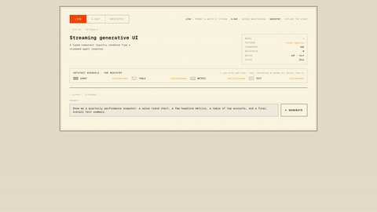
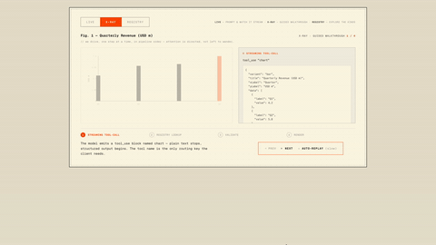

# Streaming Generative UI

*This repo is one of two small experiments written up in [Don't take the model's word for it](https://www.danwalsh.co/blog/dont-take-the-models-word-for-it).*

A small Next.js app that turns a streamed LLM response into **live UI**. You type a
prompt; the model streams back a short intro and then emits **typed tool-calls** that
render as on-screen *artifacts* — a chart, a table, a metric card, a prose block — as
they arrive, over a single connection.



The whole thing is built around one idea worth learning from:

> **A single typed registry is the source of truth for every artifact.** The model's
> tool definitions, the runtime validation, and the renderer all derive from one
> object — so there are no parallel lists to keep in sync.

It's a focused example, not a product: no database, no auth, no chat history. Read it
to see how streaming + typed tool-calls + a component registry fit together.

---

## Quick start

```bash
pnpm install
cp .env.local.example .env.local      # add your ANTHROPIC_API_KEY
pnpm dev                              # http://localhost:3000
```

Try a prompt like:

> *"show me a quarterly sales chart, a one-paragraph summary, and a short intro"*

You'll see the intro stream in word-by-word, then a bar chart draw itself, then a
markdown summary — each appearing as soon as the model emits it.

**No API key?** Run the deterministic stub adapter — same streaming pipeline, canned
output, zero API calls:

```bash
MODEL_ADAPTER=stub pnpm dev
```

---

## The three modes

The UI has a mode switcher at the top (deep-linkable via `?mode=`):

- **LIVE** — the prompt-and-render demo above.
- **X-RAY** — a stepped walkthrough of the render pipeline on one example artifact, so
  you can watch each stage (wire event → lookup → validate → render).
- **REGISTRY** — browse every artifact kind alongside its live example, its registry
  entry, and its schema.



---

## How it works

Everything flows out of `lib/registry.ts`:

```
lib/schemas.ts          Zod schemas — the structural source of truth
      │
      ▼
lib/registry.ts         { kind → schema + Component + description }
      │
      ├──▶ lib/tools.ts          schemas → tool defs (z.toJSONSchema) for the model
      │
      └──▶ lib/renderArtifact    kind → lookup → safeParse → render (or fallback)

        model stream  ──▶  app/api/generate  ──SSE──▶  useArtifactStream  ──▶  renderArtifact
        (tool-calls)       (ReadableStream)            (client)               (UI)
```

The request path, end to end:

1. The client POSTs `{ prompt }` to `/api/generate`.
2. The route asks a **`ModelAdapter`** to stream the response. The adapter normalises
   provider-specific events into a small set: `text-delta`, `tool-use`, `done`.
3. The route re-emits those as **Server-Sent Events** on the wire: `text-delta`,
   `artifact`, `done`, `error` (see `lib/wire.ts`).
4. `useArtifactStream` (a `fetch` + manual SSE reader) builds an ordered timeline.
5. `renderArtifact(kind, props)` looks the `kind` up in the registry, validates `props`
   with the schema's `safeParse`, and renders the matched component.

Because the wire carries untyped data, validation happens at the **render boundary**.
Two fallbacks make failure graceful instead of fatal:

- Unknown `kind` (not in the registry) → `<UnknownArtifact>`.
- `safeParse` fails → `<InvalidArtifact>`, showing the actual Zod issues.

### Adding a new artifact kind

It's two files, and the renderer never changes:

1. Add a schema to `lib/schemas.ts`.
2. Add **one entry** to `lib/registry.ts` (look for the `// adding another artifact`
   marker), pairing the schema with a component.

The tool definition, the type union (`ArtifactKind`), and the runtime validation all
derive automatically. The `metric` kind was added exactly this way.

---

## Routes

| Route             | Purpose                                                                 |
|-------------------|-------------------------------------------------------------------------|
| `/`               | The live demo.                                                          |
| `/dev`            | Static fixtures rendered through `renderArtifact()` — every artifact plus both fallbacks, no model involved. *(dev-only)* |
| `/api/generate`   | `POST { prompt }` → SSE stream of `text-delta` / `artifact` / `done`.   |
| `/api/dev/smoke`  | `GET` → runs the adapter against a fixed prompt, reports per-tool-call schema validity. *(dev-only)* |

---

## Design decisions

The choices that shape the code, and why each is the way it is:

1. **The registry is built with a generic `entry<S>()` helper, not a flat `Record`.** A
   flat `Record<string, { schema, Component }>` collapses `z.infer<schema>` to `unknown`
   and breaks React's component-prop typing. `entry<S>()` threads each schema's type
   through to its component, so the registry refuses to pair (say) `TextArtifact` with
   `chartSchema` at compile time.

2. **Everything derives from the registry.** `ArtifactKind`, the tool definitions, and
   runtime validation all read from the same object — the schema the model is *prompted*
   with is provably the schema it's *validated* against. (The honest limit: the wire is
   `unknown` until `safeParse`, so the guarantee is single-source derivation + runtime
   validation, not a compile-time-proven type all the way from wire to component.)

3. **The renderer is a lookup, not a `switch`.** `renderArtifact` does a registry lookup
   + `safeParse`. A `switch` would give compile-time exhaustiveness; the lookup trades
   that for single-source derivation, and a deliberate runtime fallback for unknown
   kinds (the model can emit any string).

4. **Fallbacks, not exceptions.** Validation lives only at the render boundary — *not*
   on the wire. Validating server-side would stop `<InvalidArtifact>` from ever firing,
   which would defeat the point of showing graceful failure.

5. **`ModelAdapter` is a deliberately narrow interface.** `stream({ system, messages,
   tools }) → AsyncIterable<NormalisedEvent>`. The adapter accumulates partial tool-call
   JSON internally so the route never sees half-formed input. Narrow enough to implement
   twice — the real `AnthropicAdapter` and the `StubAdapter`.

6. **Streaming is plain SSE over `POST`.** `EventSource` is GET-only, which would force
   the prompt into the URL. A manual `fetch` + tiny SSE parser is a few lines, supports
   `AbortController` cancellation, and stays observable in `curl -N`.

7. **Schemas live in their own non-`"use client"` module.** When schemas were
   co-located with client components, Next.js replaced their exports with client-
   reference proxies once a server module imported the registry — so `schema.safeParse`
   was `undefined` at runtime. Keeping `lib/schemas.ts` server-safe fixes that and lets
   `lib/tools.ts` derive tool defs on the server.

8. **The chart is a custom inline SVG component, not a chart library.** A small
   `Chart.tsx` driven by a pure `lib/chartGeometry.ts` (data → SVG coordinates) gives the
   line-draw stream-in animation and the minimal aesthetic without a heavy dependency.

---

## Scope

**In:** four artifact kinds (chart, table, metric, text); the registry and its derived
types; Zod validation; tool derivation; streamed tool-use via the Vercel AI SDK; the SSE
route and client; progressive render; the two fallbacks; a swappable stub adapter; a
Vitest + React Testing Library suite.

**Out (on purpose):** persistence, auth, rate-limiting, multi-turn chat, multi-agent
orchestration, an eval harness, and any artifact needing a third-party API (e.g. maps).

---

## Project layout

```
app/
  api/generate/route.ts      SSE handler: POST prompt → text-delta/artifact/done
  api/dev/smoke/route.ts     Dev: validates each tool call against its schema
  dev/page.tsx               Dev: static fixture page (no model)
  page.tsx                   The live demo (mode switcher)
components/
  artifacts/                 Chart, Table, Metric, Text + Unknown/Invalid fallbacks
  plate/                     The shell, mode switcher, and X-RAY / REGISTRY views
hooks/
  useArtifactStream.ts       fetch + manual SSE reader; ordered timeline state
lib/
  schemas.ts                 Zod schemas — single source of structural truth
  registry.ts                The registry. Adding an artifact = one entry here.
  renderArtifact.tsx         Lookup + safeParse + fallbacks (no switch)
  tools.ts                   Tool defs derived from the registry; system prompt
  wire.ts                    Shared SSE WireEvent type (server + client)
  chartGeometry.ts           Pure data → SVG coordinate maths
  model/
    adapter.ts               ModelAdapter interface + event types
    anthropic.ts             Real adapter — wraps the Vercel AI SDK (streamText)
    stub.ts                  Canned-events adapter for offline demos
```

---

## Stack

- Next.js 16 (App Router) + TypeScript (`strict`) + Turbopack
- Vercel AI SDK Core (`ai` + `@ai-sdk/anthropic`) for streaming + tool use
- Zod 4 (native `z.toJSONSchema` — no third-party converter)
- Tailwind v4 + `@tailwindcss/typography`; custom inline SVG chart; react-markdown
- Model: `claude-haiku-4-5` by default, set via `ANTHROPIC_MODEL`

---

## License

MIT — see [`LICENSE`](./LICENSE).
